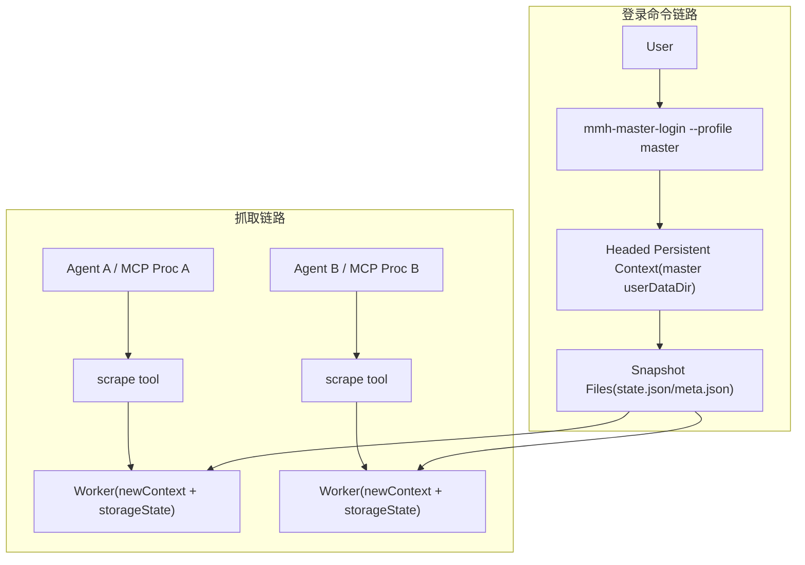
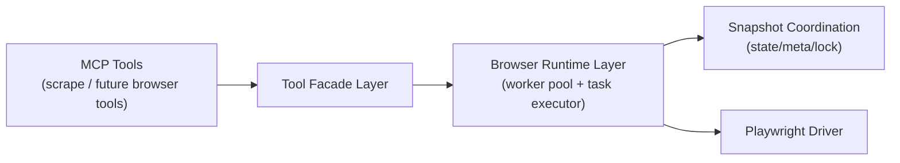

# 一、需求分析

## 1.1 目标

在 `core` 模块新增 `scrape` 工具，面向 Agent 提供单页抓取能力，支持以下单一 `format` 输出：

- `markdown`
- `html`
- `links`
- `screenshot`
- `fullscreenshot`

## 1.2 功能范围

1. 新增 MCP 工具：`scrape(url, format, onlyMainContent, waitFor, profileId)`。
2. 每次请求仅返回一种格式结果。
3. 抓取默认使用 headless。
4. 提供独立登录命令（脚本/CLI）用于人工启动 `master` 的 headed 会话并发布快照。
5. 多 Agent（多 MCP 进程）共享同一 `profileId` 会话状态。
6. 将 worker + Playwright 管理能力抽取为通用运行时层，供后续 `BrowserMcp` 类能力复用。

## 1.3 非功能要求

1. 多进程场景可用，不引入额外中心守护进程。
2. 禁止目录级 profile 复制、禁止直接读写 Chrome profile 数据文件。
3. `storageState` 同步仅使用 Playwright 官方 API。
4. `master` 不需要手工预创建，系统自动安全初始化。
5. 运行时抽象需与具体 MCP 工具解耦，确保后续新增浏览器类工具时不重复建设基础设施。

## 1.4 现状与约束

| 主题 | 结论 | 证据 |
| --- | --- | --- |
| MCP 工具现状 | 目前仅有 `search`、`create_temp_dir` | `/home/fengwk/prog/my-mcp-hub/core/src/main/java/fun/fengwk/mmh/core/mcp/UtilMcp.java:21`，`/home/fengwk/prog/my-mcp-hub/core/src/main/java/fun/fengwk/mmh/core/mcp/UtilMcp.java:42` |
| Service 现状 | `UtilMcpService` 尚无 `scrape` 能力 | `/home/fengwk/prog/my-mcp-hub/core/src/main/java/fun/fengwk/mmh/core/service/UtilMcpService.java:10` |
| 依赖现状 | `core` 尚未引入 Playwright/Jsoup | `/home/fengwk/prog/my-mcp-hub/core/pom.xml:13` |
| 运行模式 | CLI 采用 `stdio + SYNC`，多 Agent 常见多进程 | `/home/fengwk/prog/my-mcp-hub/cli/cli-util/src/main/resources/application.yml:12`，`/home/fengwk/prog/my-mcp-hub/cli/cli-util/src/main/resources/application.yml:13` |
| 测试基线问题 | `UtilMcpTest` 仍调用已注释 `workflowTrace` | `/home/fengwk/prog/my-mcp-hub/core/src/test/java/fun/fengwk/mmh/core/mcp/UtilMcpTest.java:104`，`/home/fengwk/prog/my-mcp-hub/core/src/main/java/fun/fengwk/mmh/core/mcp/UtilMcp.java:56` |

外部技术约束：

1. Playwright Java 对象不应跨线程并发共享（官方多线程说明）。
2. 同一 `userDataDir` 不允许并发启动多实例（官方 API 说明）。

参考：

- `https://playwright.dev/java/docs/multithreading`
- `https://playwright.dev/java/docs/api/class-browsertype#browser-type-launch-persistent-context`

## 1.5 关键术语

1. `profileId`：逻辑会话空间键（可按“1 账号 = 1 profileId”组织）。
2. `master`：默认 `profileId`，用于共享登录态。
3. 快照：`storageState` 导出结果（JSON）。

# 二、技术方案

## 2.1 总体架构（多进程、无中心服务）



架构要点：

1. `scrape` 仅 headless，worker 不打开 persistent profile。
2. 人工登录通过独立命令打开 headed persistent `master`。
3. 多进程通过共享快照文件同步会话。

### 2.1.1 通用化分层（面向后续 BrowserMcp）



分层约束：

1. `Browser Runtime Layer` 不感知 `scrape` 业务字段，仅接收通用任务定义。
2. `scrape` 通过适配器把请求转换为运行时任务，结果再映射为 `ScrapeResponse`。
3. 后续 `BrowserMcp` 类工具只复用 Runtime + Snapshot 层，新增自身 Facade/Result 映射即可。

## 2.2 接口与命令设计

### 2.2.1 MCP 工具：`scrape`

```java
@Tool(name = "scrape", ...)
public String scrape(
    String url,
    String format,
    Boolean onlyMainContent,
    Integer waitFor,
    String profileId
)
```

参数契约：

| 参数 | 默认值 | 约束 |
| --- | --- | --- |
| `url` | 无 | 必填，`http/https` |
| `format` | `markdown` | `markdown/html/links/screenshot/fullscreenshot` |
| `onlyMainContent` | `true` | 可空，空则默认 true |
| `waitFor` | `0` | `0 <= waitFor <= 60000` |
| `profileId` | `master` | 可空；仅允许 `[a-zA-Z0-9._-]{1,64}`，禁止路径分隔符 |

### 2.2.2 登录命令：`mmh-master-login`

脚本命令：

```bash
scripts/mmh-master-login --profile master
```

命令行为：

1. 初始化快照空间（不存在则创建）。
2. 获取 `login.lock`（防止并发登录命令冲突）。
3. 打开 headed persistent context（指定 `master userDataDir`）。
4. 用户登录期间按固定间隔发布快照。
5. 退出前发布最终快照并释放锁。

## 2.3 数据与目录设计

共享快照目录：

```text
${mmh.scrape.snapshot-root}/
  master/
    state.json
    meta.json
    login.lock
    publish.lock
    tmp/
```

`meta.json` 字段：

1. `profileId`
2. `version`
3. `updatedAt`
4. `writerId`
5. `checksum`（可选）

## 2.4 核心流程

### 2.4.1 `scrape` 流程（headless-only）

```java
ScrapeResponse scrape(ScrapeRequest req) {
    String pid = normalizeProfileId(req.getProfileId());
    snapshotBootstrap.ensureInitialized(pid);
    StorageStateSnapshot snapshot = snapshotStore.readLatest(pid);

    return workerExecutor.executeHeadless(req, snapshot, context -> {
        snapshotPublisher.tryPublishAsync(pid, context); // debounce + single-flight
    });
}
```

### 2.4.2 登录命令流程

```java
void login(String profileId) {
    snapshotBootstrap.ensureInitialized(profileId);
    loginLockManager.acquire(profileId);
    try {
        HeadedSession session = masterLoginRuntime.open(profileId);
        while (!userConfirmedDone()) {
            snapshotPublisher.publishFromContext(profileId, session.context());
            sleep(refreshIntervalMs);
        }
        snapshotPublisher.publishFromContext(profileId, session.context());
    } finally {
        loginLockManager.release(profileId);
    }
}
```

### 2.4.3 `master` 安全初始化

初始化规则：

1. `mkdir -p snapshotRoot/profileId/tmp`。
2. 若 `state.json/meta.json` 缺失，写入初始版本（`version=0`）。
3. 文件发布采用“临时文件 + 原子 rename”，避免半写入。

### 2.4.4 快照发布防回滚（CAS）

为避免旧任务覆盖新登录态，快照发布必须采用版本比较：

1. 任务开始时读取 `baseVersion`。
2. 任务结束发布时先读取当前版本 `currentVersion`。
3. 仅当 `currentVersion == baseVersion` 时允许发布；否则放弃发布并记录日志。
4. 发布临界区用 `publish.lock` 短锁保护，写入采用临时文件 + 原子 rename。

```java
boolean tryPublish(String profileId, long baseVersion, BrowserContext ctx) {
    publishLockManager.acquire(profileId);
    try {
        long current = snapshotStore.currentVersion(profileId);
        if (current != baseVersion) {
            return false; // stale snapshot, drop
        }
        String state = ctx.storageState();
        snapshotStore.atomicWrite(profileId, current + 1, state);
        return true;
    } finally {
        publishLockManager.release(profileId);
    }
}
```

## 2.5 并发与一致性

### 2.5.1 并发模型

1. 保留短锁：`login.lock` 与快照发布临界区。
2. 移除重型机制：
   - 全局请求排队
   - headless/headed 运行时切换状态机
   - 长生命周期 owner 调度器

### 2.5.2 一致性语义

1. 新任务读取最新快照版本。
2. in-flight 任务使用启动时快照，不中断。
3. 模型为最终一致（eventual consistency）。

### 2.5.3 冲突结论

1. 冲突来源：并发打开同一 `userDataDir`。
2. 非冲突来源：`storageState` 导出/导入。
3. 快照发布不要求重启 Chrome 进程。

### 2.5.4 `profileId` 安全约束

1. `profileId` 必须命中 `profile-id-regex`。
2. 禁止包含 `/`、`\\`、`..` 等路径穿越片段。
3. 实际路径统一由 `Path.resolve(profileId).normalize()` 生成，并校验仍位于 `snapshot-root` 下。

## 2.6 页面处理与 Markdown

1. `waitFor` 与 `smartWait` 互斥：
   - `waitFor > 0` 用固定等待；
   - 否则执行 `smartWait`。
2. `onlyMainContent=true` 时进行正文清理。
3. markdown 为空时回退全量内容再转换。
4. Markdown 采用“渲染 + 后处理 + 质量门禁”链路，质量目标不低于 firecrawl 基线。

## 2.7 类设计

### 2.7.1 新增类（通用运行时层）

| 类 | 路径 | 职责 |
| --- | --- | --- |
| `BrowserTask` | `core/src/main/java/fun/fengwk/mmh/core/service/browser/runtime/BrowserTask.java` | 浏览器任务抽象（输入/输出泛型） |
| `BrowserWorkerManager` | `.../service/browser/runtime/BrowserWorkerManager.java` | 进程内 worker 池管理与限流 |
| `BrowserTaskExecutor` | `.../service/browser/runtime/BrowserTaskExecutor.java` | 通用执行编排（加载快照、执行任务、发布快照） |
| `BrowserRuntimeContext` | `.../service/browser/runtime/BrowserRuntimeContext.java` | 暴露 Page/Context/元信息给任务实现 |
| `SnapshotBootstrap` | `.../service/browser/coordination/SnapshotBootstrap.java` | 快照空间初始化 |
| `SnapshotStore` | `.../service/browser/coordination/SnapshotStore.java` | 快照读写与版本管理 |
| `SnapshotPublisher` | `.../service/browser/coordination/SnapshotPublisher.java` | 异步快照发布（CAS + debounce） |
| `LoginLockManager` | `.../service/browser/coordination/LoginLockManager.java` | 登录命令锁 |
| `MasterLoginRuntime` | `.../service/browser/runtime/MasterLoginRuntime.java` | headed 登录运行时 |

### 2.7.2 新增类（scrape 适配层）

| 类 | 路径 | 职责 |
| --- | --- | --- |
| `PageScrapeService` | `core/src/main/java/fun/fengwk/mmh/core/service/scrape/PageScrapeService.java` | 抓取入口 |
| `PageScrapeServiceImpl` | `.../service/scrape/impl/PageScrapeServiceImpl.java` | 主流程编排 |
| `ScrapeRequest/ScrapeResponse/ScrapeFormat` | `.../service/scrape/model/` | 模型与枚举 |
| `ScrapeBrowserTask` | `.../service/scrape/runtime/ScrapeBrowserTask.java` | 将抓取流程封装为通用 BrowserTask |
| `HtmlMainContentCleaner` | `.../service/scrape/parser/HtmlMainContentCleaner.java` | 主内容清理 |
| `MarkdownRenderer` | `.../service/scrape/parser/MarkdownRenderer.java` | HTML->Markdown |
| `MarkdownPostProcessor` | `.../service/scrape/parser/MarkdownPostProcessor.java` | Markdown 后处理 |
| `LinkExtractor` | `.../service/scrape/parser/LinkExtractor.java` | 链接提取去重 |

### 2.7.3 现有类改造

| 类 | 路径 | 改造点 |
| --- | --- | --- |
| `UtilMcp` | `core/src/main/java/fun/fengwk/mmh/core/mcp/UtilMcp.java` | 新增 `scrape` 工具 |
| `UtilMcpService` | `core/src/main/java/fun/fengwk/mmh/core/service/UtilMcpService.java` | 新增 `scrape(...)` |
| `UtilMcpServiceImpl` | `core/src/main/java/fun/fengwk/mmh/core/service/impl/UtilMcpServiceImpl.java` | 参数归一化并调用抓取服务 |
| 模板 | `core/src/main/resources/mcp/templates/mmh_scrape_result.ftl` | 单格式输出模板 |

### 2.7.4 脚本与 CLI

1. 新增 `scripts/mmh-master-login`。
2. 在 `cli-util` 增加 `master-login` 命令入口，脚本调用该入口执行登录流程。

## 2.8 依赖与配置

### 2.8.1 依赖

`core/pom.xml` 新增：

1. `com.microsoft.playwright:playwright`
2. `org.jsoup:jsoup`

### 2.8.2 配置（`mmh.scrape`）

| 配置项 | 默认值 | 说明 |
| --- | --- | --- |
| `default-profile-id` | `master` | 默认会话空间 |
| `snapshot-root` | `${user.home}/.mmh/browser-snapshots` | 快照目录 |
| `master-user-data-root` | `${user.home}/.mmh/browser-data` | 登录命令 persistent profile 根目录 |
| `worker-pool-size-per-process` | `4` | 每进程 worker 数（后续迁移到 `mmh.browser.*`） |
| `request-queue-capacity` | `200` | 请求队列容量（后续迁移到 `mmh.browser.*`） |
| `queue-offer-timeout-ms` | `200` | 入队超时（后续迁移到 `mmh.browser.*`） |
| `snapshot-refresh-on-request-end` | `true` | 请求结束刷新 |
| `snapshot-refresh-interval-ms` | `30000` | 周期刷新兜底 |
| `snapshot-refresh-debounce-ms` | `500` | 刷新合并窗口 |
| `master-login-refresh-interval-ms` | `5000` | 登录命令刷新间隔 |
| `master-login-timeout-ms` | `0` | 登录命令超时（0 表示不超时） |
| `include-indexed-db-in-snapshot` | `false` | 默认不导出 IndexedDB |
| `profile-id-regex` | `^[a-zA-Z0-9._-]{1,64}$` | `profileId` 校验规则 |
| `snapshot-publish-lock-timeout-ms` | `500` | `publish.lock` 获取超时 |
| `snapshot-dir-permission` | `700` | 快照目录权限 |
| `snapshot-file-permission` | `600` | `state/meta` 文件权限 |

### 2.8.3 配置抽取规划（`mmh.browser`）

为支持后续 `BrowserMcp` 类能力，运行时公共配置抽取为 `mmh.browser.*`，`mmh.scrape.*` 仅保留抓取业务参数。

建议抽取项：

1. `worker-pool-size-per-process`
2. `request-queue-capacity`
3. `queue-offer-timeout-ms`
4. `snapshot-refresh-on-request-end`
5. `snapshot-refresh-interval-ms`
6. `snapshot-refresh-debounce-ms`
7. `snapshot-publish-lock-timeout-ms`
8. `profile-id-regex`

## 2.9 风险与应对

| 风险 | 触发条件 | 影响 | 应对 |
| --- | --- | --- | --- |
| 登录命令并发冲突 | 多人同时执行登录命令 | profile 占用冲突 | `login.lock` 短锁 + 明确错误文案 |
| 旧快照回滚覆盖 | 旧任务晚于新登录态完成 | 新会话被旧状态覆盖 | `baseVersion` CAS + `publish.lock`，不满足条件直接丢弃 |
| 初始无登录态 | `master` 新建后未登录 | 受限页面抓取失败 | 错误提示引导执行登录命令 |
| 快照体积过大 | IndexedDB/状态膨胀 | 导出耗时上升 | 默认禁用 IndexedDB，按需开启 |
| 快照敏感信息泄漏 | 目录权限过宽或日志误打 | 会话泄露风险 | 快照目录/文件权限收敛（700/600），禁止日志打印 `state.json` 内容 |

## 2.10 实施步骤

1. 处理 `workflowTrace` 测试与实现不一致问题。
2. 抽取通用 `Browser Runtime + Snapshot Coordination` 基础设施。
3. 在 `scrape` 中接入通用运行时，先落最小链路（`html/screenshot`）。
4. 落登录命令（脚本 + runtime）。
5. 落正文/markdown 解析链路与模板。
6. 完成配置拆分（`mmh.browser` / `mmh.scrape`）与测试回归。

# 三、测试用例

## 3.1 测试策略

1. 单元测试：参数校验、等待策略、正文回退、格式映射、错误映射。
2. 组件测试：`UtilMcp -> UtilMcpService -> PageScrapeService`。
3. 集成测试：多进程共享快照、登录命令联动、首次自动初始化。

## 3.2 关键场景

| 编号 | 场景 | 预期 |
| --- | --- | --- |
| TC-01 | 五种 format 基本成功 | 返回对应 payload |
| TC-02 | `waitFor` 显式等待 | 跳过 smartWait |
| TC-03 | smartWait 默认策略 | 结果稳定返回 |
| TC-04 | `onlyMainContent` 回退 | 正文为空时回退全量 |
| TC-05 | 参数非法 | 400 且错误清晰 |
| TC-06 | 首次无 `master` | 自动初始化快照空间 |
| TC-07 | 登录命令可用 | headed 登录后成功发布快照 |
| TC-08 | 登录命令并发冲突 | 第二个命令快速失败 |
| TC-09 | 多进程会话共享 | 登录后不同进程新请求均可复用会话 |
| TC-10 | 快照发布无进程重启 | 发布期间无浏览器重启 |
| TC-11 | 刷新合并生效 | 高频场景下导出次数受控 |
| TC-12 | `profileId` 隔离 | 不同 profile 间会话互不污染 |
| TC-13 | Markdown 质量基线 | 不低于 firecrawl 对标阈值 |
| TC-14 | 快照防回滚 | 旧任务晚完成且 `baseVersion` 落后 | 发布被丢弃，不覆盖新版本 |
| TC-15 | `profileId` 非法输入 | 含路径分隔符或 `..` | 返回 400 且拒绝访问文件系统 |
| TC-16 | 快照权限校验 | 首次初始化后检查权限 | 目录 700、文件 600 |
| TC-17 | 通用运行时复用 | 用 `BrowserTask` 伪实现接入第二工具 | 无需改动运行时主干即可执行 |
| TC-18 | 配置拆分兼容 | 同时存在 `mmh.browser.*` 与 `mmh.scrape.*` | 读取优先级正确且行为一致 |

## 3.3 测试类清单

1. `core/src/test/java/fun/fengwk/mmh/core/mcp/UtilMcpTest.java`
2. `core/src/test/java/fun/fengwk/mmh/core/service/impl/UtilMcpServiceImplTest.java`
3. `core/src/test/java/fun/fengwk/mmh/core/service/scrape/impl/PageScrapeServiceImplTest.java`
4. `core/src/test/java/fun/fengwk/mmh/core/service/browser/coordination/SnapshotBootstrapTest.java`
5. `core/src/test/java/fun/fengwk/mmh/core/service/browser/coordination/SnapshotStoreTest.java`
6. `core/src/test/java/fun/fengwk/mmh/core/service/browser/coordination/LoginLockManagerTest.java`
7. `core/src/test/java/fun/fengwk/mmh/core/service/scrape/parser/HtmlMainContentCleanerTest.java`
8. `core/src/test/java/fun/fengwk/mmh/core/service/scrape/parser/MarkdownRendererTest.java`
9. `core/src/test/java/fun/fengwk/mmh/core/service/scrape/parser/MarkdownPostProcessorTest.java`
10. `core/src/test/java/fun/fengwk/mmh/core/service/scrape/model/ProfileIdValidatorTest.java`
11. `core/src/test/java/fun/fengwk/mmh/core/service/browser/runtime/BrowserTaskExecutorTest.java`

## 3.4 验证命令

```bash
env JAVA_HOME=$JAVA_HOME_17 mvn -pl core test
env JAVA_HOME=$JAVA_HOME_17 mvn -pl core -Dtest=UtilMcpTest test
```
